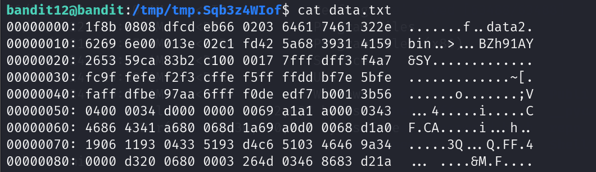

# Overthewire_Bandit

Welcome to the GitHub walkthrough for the Bandit Wargame! This repository is designed to guide you through the levels of Bandit. 
Bandit is structured as a series of progressively challenging levels, starting from Level 0 and culminating in Level 34. 
Each level presents unique tasks that will help you build essential skills in navigating the Linux command line, 
working with files, and understanding basic security concepts. By successfully completing each level, you'll unlock the next, 
gaining valuable knowledge and experience along the way.

This walkthrough provides detailed instructions, tips, and solutions for each level, making it easier for you to understand the concepts 
and techniques required to progress.

I am using Kali Linux Virtual Machine for this entire task. 

## Level 0 -> 1

`ssh bandit0@bandit.labs.overthewire.org -p 2220`
   
Here, `-p` specifies the port number of the secure shell connection to the target server. 
Use the password `bandit0` to login.

Use `ls` to find all the files in the current directory. We find `readme`. 

Use `cat readme` to find the password to the next level.

The password to next level is
ZjLjTmM6FvvyRnrb2rfNWOZOTa6ip5If

## Level 1 -> Level 2

Use `ssh` to login with the password of the previous step.

Use `ls`, we find a file with name `-`.

Use cat ./- to handle the filename issue, and you will find the password.

The password to next level is
263JGJPfgU6LtdEvgfWU1XP5yac29mFx

## Level 2 -> Level 3

Use `ssh` to login with the password of the previous step.

Use `ls`, we find the file named `spaces in this filename`.

Use `cat "spaces in this filename"`, and you will find the password.

The password to next level is
MNk8KNH3Usiio41PRUEoDFPqfxLPlSmx

## Level 3 ->  Level 4

Use `ssh` to login with the password of the previous step.

Use `ls`, then use `cd inhere` to enter the directory.

Enter the `inhere` folder, use `ls -la` again, we find the file `...Hiding-From-You`.

Use `cat ...Hiding-From-You`, and you will find the password.

The password to next level is
2WmrDFRmJIq3IPxneAaMGhap0pFhF3NJ

## Level 4 -> Level 5

Use `ssh` to login with the password of the previous step.

Use `ls`, then use `cd inhere` to enter the directory. We find `-file00` ... `-file09`.

Use `file ./*` (the ./ is used for escaping `-` in the filenames),

Use `cat ./file07` open the ASCII text file and obtain the password.

The password to next level is 
4oQYVPkxZOOEOO5pTW81FB8j8lxXGUQw

## Level 5 -> Level 6

Use `ssh` to login with the password of the previous step.

`cd inhere`

We want to find the files that is human-readable, size 1033 bytes and non-executable.

`find -type f -size 1033c | file -f- | grep -i 'text'`

Here `-type f` seraches for the file instead of directory, `-size 1033c` specifies the size of the file, the `-f-` flag specifies the input is a list of files, `grep -i 'text'` filters the human-readable file.

Open the file and find the password.

The password to next level is 
HWasnPhtq9AVKe0dmk45nxy20cvUa6EG

## Level 6 -> Level 7

Use `ssh` to login with the password of the previous step.

`find / -user bandit7 -group bandit6 -size 33c 2>/dev/null`

Here `-user` and `-group` specify the user and group name. `2>/dev/null` discards the error message.

Use `cat /var/lib/dpkg/info/bandit7.password` and find the password.

The password to next level is 
morbNTDkSW6jIlUc0ymOdMaLnOlFVAaj

## Level 7 -> Level 8

Use `ssh` to login with the password of the previous step.

`cat data.txt | grep -i "millionth"

The password to next level is 
dfwvzFQi4mU0wfNbFOe9RoWskMLg7eEc

## Level 8 -> Level 9

Use `ssh` to login with the password of the previous step.

Use `ls`, we find `data.txt`. Use `sort data.txt | uniq -u`

Here `sort` sorts the txt file according to rows, `uniq -u` only prints unique lines.

The password to next level is 
4CKMh1JI91bUIZZPXDqGanal4xvAg0JM

## Level 9 -> Level 10

`cat data.txt | grep -a =====` 

Here data.txt is a binary file, we need to add `-a` option so 
that `grep` can process as if it were text

The password to next level is 
FGUW5ilLVJrxX9kMYMmlN4MgbpfMiqey

## Leve 10 -> Level 11

`cat data.txt | base64 -d`

Here the option `-d` is used to decode the base64 encoding.

The password to next level is 
dtR173fZKb0RRsDFSGsg2RWnpNVj3qRr

## Level 11 -> Level 12

`cat data.txt | tr 'a-zA-Z' 'n-za-mN-ZA-M'`

Here since we want to rotate the letter by 13 position, 
we need to rotate a → n, b → o, ..., n → a, o → b and similarly 
for the capitalized letter. By using `tr`, we complete 
this rotation.

The password to next level is 
7x16WNeHIi5YkIhWsfFIqoognUTyj9Q4

## Level 12 -> Level 13

Since we are only allow to write in `tmp` folder, we first 
make a folder inside.

`mktemp -d`

The temp directory is /tmp/tmp.Sqb3z4WIof

`cp /home/bandit12/data.txt /tmp/tmp.Sqb3z4WIof`

Enter the temp folder, inspect the file, it is a hex dump.

We can use `xxd -r` to decode the hexdump. 

`xxd -r data.txt > decode.txt`

We check the file type using

`file decode.txt`

Let us uncompress the file using gunzip, before that, we need 
to modify the extension to `.gz`

`mv decode.txt data2.bin.gz && gunzip data2.bin.gz`

We get a new file `data2.bin`. 

`mv data2.bin data2.bin.bz2 && bzip2 -d data2.bin.bz2`

Check the file type, and repeat the previous steps. 

This time we get a tar archive.

`mv data5.bin data4.bin.tar && tar -xvf data5.bin.tar`

`-v` means verbose. `-x` is for extraction. 
`-f` uses archive file or device ARCHIVE.

We get `data5.bin`

Repeat the previous step

`mv data5.bin data5.bin.tar && tar -xvf data5.bin.tar`

We get `data6.bin`

Repeat the previous step

`mv data6.bin data6.bin.bz2 && bzip2 -d data6.bin.bz2`

Repeat the previous step

`mv data6.bin data6.bin.tar && tar -xvf data6.bin.tar`

We get `data8.bin`

Repeat

`mv data8.bin data8.bin.gz && gunzip data8.bin.gz`

We get the password

The password to next level is 
FO5dwFsc0cbaIiH0h8J2eUks2vdTDwAn

## Level 13 -> Level 14

There is a ssh private key in the level 13

We copy the ssh private key to our local machine as `sshkey.private`

We need to set the key to be only readable to the owner

`chmod 400`

We use the private key to log in to level 14

`ssh -i sshkey.private bandit14@bandit.labs.overthewire.org -p 2220`

Success. We can retrieve the password for level 14 by 

`cat /etc/bandit_pass/bandit14`

The password to next level is 
MU4VWeTyJk8ROof1qqmcBPaLh7lDCPvS

## Level 14 -> Level 15

Log in to level 14, use

`nc -nv 127.0.0.1 30000`

Here 127.0.0.1 is the ip for localhost, `-n` flag disables the 
DNS resolution, `-v` is the verbose mode. 

After connecting, submit the password of level 14, we retrieve the password for Level 15.

The password to next level is 
8xCjnmgoKbGLhHFAZlGE5Tmu4M2tKJQo